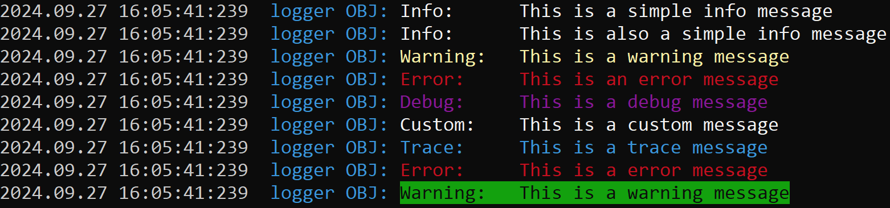
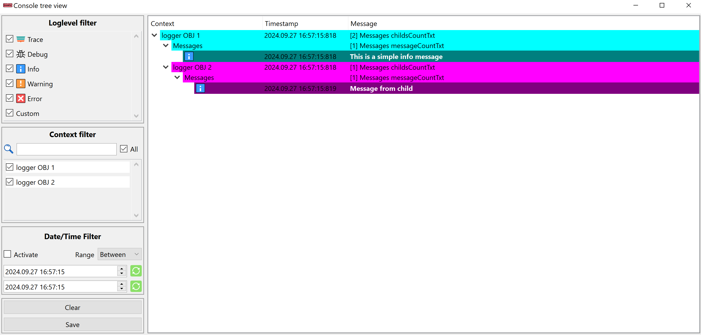
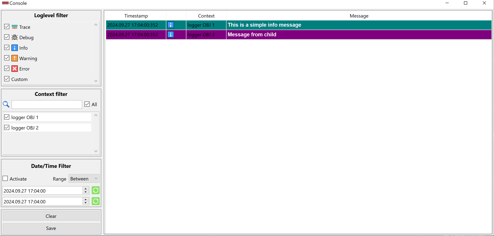
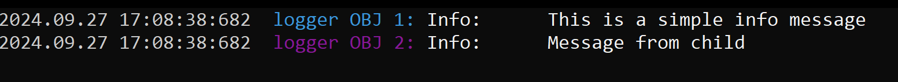

# Logger

## Overview
* [About](#about)
* [Concept](#concept)
* [Installation](#installation)
  * [Dependencies](#dependencies)
  * [How to build](#how-to-build)
* [How to use](#how-to-use)
  * [Basic example](#basic-example)
* [Receiver types](#receiver-types)
  * [QTreeConsoleView](#qtreeconsoleview)
  * [QConsoleView](#qconsoleview)
  * [NativeConsoleView](#nativeconsoleview)
  * [FilePlotter](#fileplotter)
  * [Custom receiver implementation](#custom-receiver-implementation)


## About
>  This library was created using the [library template](https://github.com/KROIA/QT_cmake_library_template)


The logger library can be used in your project to print messages to the console. A message is categorized in 6 levels: 

|Level |Meaning |
|---|---|
|<span style="color:rgb(0,255,255)">trace</span>|Can be used to print call stacks|
|<span style="color:rgb(255,0,255)">debug</span>|Debug infos that are used for development|
|<span style="color:rgb(0,0,0)">info</span>|Info outputs that can be helpfull for the end user|
|<span style="color:rgb(230,230,0)">warning</span>|Warning messages|
|<span style="color:rgb(255,0,0)">error</span>|Error messages|
|<span style="color:rgb(0,255,0)">custom</span>|No specific usecase, just another separate category |

---
## Concept
The library uses the Qt signal & slot system to send and receive log messages from all the log objects.
You have to create a [receiver object](#receiver-types) that receives the messages. It is the responsability of the receiver to save the messages. Log objects do not save the messages they create.

---

## Installation
#### Dependencies
* Qt5 or Qt6 [click here for more informations.](https://github.com/KROIA/QT_cmake_library_template/blob/main/documentation/HowToUse.md#dependencies) 
* Qt modules
  * Core
  * Widgets

#### How to build
* If you want to use the logger library in a project that is based on the [library template](https://github.com/KROIA/QT_cmake_library_template), you can simply copy the `Logger.cmake` file to your projects `dependencies` folder and reconfigure that project.

* If you want to use the logger library as standalone build and include the logger lib manually to your project, download the repository and run the `build.bat` or open the CMakeLists.txt using Visual Studio and build and install the library.

---

## How to use

#### Basic example
``` C++
#include <QApplication>
#include "Logger.h"

int main(int argc, char *argv[])
{
    QApplication app(argc, argv);

    // (1)
    // Create a console view
    Log::UI::NativeConsoleView plotter;

    // (2)
    // Create a logger object
    Log::LogObject logger("logger OBJ");

    // (3)
    logger.setColor(Log::Colors::Console::Foreground::cyan);

    // (4)
    logger.log("This is a simple info message");
    logger.logInfo("This is also a simple info message");
    logger.logWarning("This is a warning message");
    logger.logError("This is an error message");
    logger.logDebug("This is a debug message");
    logger.logCustom("This is a custom message");
    logger.logTrace("This is a trace message");

    logger.log("This is a error message",   Log::Level::error);
    logger.log("This is a warning message", Log::Level::warning, Log::Colors::Console::Background::green);	

    // Qt event loop is needed since the logger has emited message signals to the console
    return app.exec();
}
```
1) Create a receiver that listens to the signals from the log objects.
2) The logger object is used to create log messages. 
3) Each logger object can have a individual color which is used on the console.
4) Depending on which log level you want to use for your message, you can call a specific function. Or you an use the general `.log(...)` function and specify the log level and color for the message.

<div style="text-align: center;">
    
</div>


## Receiver types
There are 4 different receiver types available.
* `QTreeConsoleView`
* `QConsoleView` 
* `NativeConsoleView`
* `FilePlotter`

#### QTreeConsoleView

``` C++
#include <QApplication>

#include "Logger.h"
#include <QTimer>

int main(int argc, char *argv[])
{
  QApplication app(argc, argv);

  // Create a console view
  Log::UI::QTreeConsoleView treeConsole;
  treeConsole.show();

  // Create a logger object
  Log::LogObject logger1("logger OBJ 1");
  // Create the second logger object as child from logger1
  Log::LogObject logger2(logger1.getID(), "logger OBJ 2");
	
  logger1.setColor(Log::Colors::Console::Foreground::cyan);
  logger2.setColor(Log::Colors::Console::Foreground::magenta);
	
  logger1.log("This is a simple info message");
  logger2.log("Message from child");

  // Qt event loop is needed since the logger has emited message signals to the console
  return app.exec();
}
```
<div style="text-align: center;">
    
</div>

The `QTreeConsoleView` is used when you want to preserve the tree structure of the different `LogObjects` in your application. A `LogObject` can have multiple child loggers.

#### QConsoleView
``` C++
...
int main(int argc, char *argv[])
{
  QApplication app(argc, argv);

  // Create a console view
  Log::UI::QConsoleView consoleView;  
  consoleView.show();
  ...
}
```
<div style="text-align: center;">
    
</div>

The `QConsoleView` does not reperesent the tree structure of the log objects. Instead it plots all messages like a normal console. The difference to the [NativeConsoleView](#nativeconsoleview) is, that you can analyze the log better. 

#### NativeConsoleView
``` C++
...
int main(int argc, char *argv[])
{ 
  QApplication app(argc, argv);

  // Create a console view
  Log::UI::NativeConsoleView consoleView; 
  consoleView.show();
  ...
}
```
<div style="text-align: center;">
    
</div>

The NativeConsolePlotter is the most basic form of a console window. It does not visualize the tree structure of the log objects.

#### FilePlotter
``` C++
...
int main(int argc, char *argv[])
{ 
  QApplication app(argc, argv);

  // Create a plotter
  Log::FilePlotter plotter("outputFile.txt");

  ...
}
```
The plotter does not visualize the log messages. It stores them directly to a file in a json format.
The json format is not easy to read by hand but it is better for analyzing the log file with a separate tool.

``` Json
[
  {
    "levelInfo": {
      "Custom": 5,
      "Debug": 1,
      "Error": 4,
      "Info": 2,
      "Trace": 0,
      "Warning": 3
    },
    "name": "Logger",
    "version": "00.01.0000"
  },
  {
    "color": "#FFFFFF",
    "creationTime": "2024.09.27 17:15:05:973",
    "enabled": true,
    "id": 1,
    "name": "logger OBJ 1",
    "parentId": 0
  },
  {
    "color": "#FFFFFF",
    "creationTime": "2024.09.27 17:15:05:973",
    "enabled": true,
    "id": 2,
    "name": "logger OBJ 2",
    "parentId": 1
  },
  {
    "color": "#00FFFF",
    "creationTime": "2024.09.27 17:15:05:973",
    "enabled": true,
    "id": 1,
    "name": "logger OBJ 1",
    "parentId": 0
  },
  {
    "color": "#FF00FF",
    "creationTime": "2024.09.27 17:15:05:973",
    "enabled": true,
    "id": 2,
    "name": "logger OBJ 2",
    "parentId": 1
  },
  {
    "color": "#FFFFFF",
    "dateTime": "2024.09.27 17:15:05:973",
    "id": 1,
    "level": 2,
    "text": "This is a simple info message"
  },
  {
    "color": "#FFFFFF",
    "dateTime": "2024.09.27 17:15:05:973",
    "id": 2,
    "level": 2,
    "text": "Message from child"
  }
]
```

#### Custom receiver implementation
``` C++
#pragma once
#include "Logger_base.h"
#include "LogMessage.h"
#include "AbstractReceiver.h"

class CustomReceiver : public AbstractReceiver
{
  public:
    CustomReceiver();
    ~CustomReceiver();

  protected:
    // Gets called when a new LogObject was created 
    void onNewLogger(LogObject::Info loggerInfo) override;
    
    // Gets called when the for example, the color of a LogObject got changed.
    void onLoggerInfoChanged(LogObject::Info info) override;

    // Gets called when a new message was sent from a LogObject
    void onLogMessage(Message message) override;
    
    // Gets called when a LogObject with the ID <childID> 
    // got assigned to a new parent logger with the ID <newParentID>
    void onChangeParent(LoggerID childID, LoggerID newParentID) override;
  private:
  };
}
```
To implement your custom receiver you just have to create a new class that derives from the `AbstractReceiver` base class.
You don't have to worry about connecting signals to receive logs, just instantiate your object and you will receive all messages.
