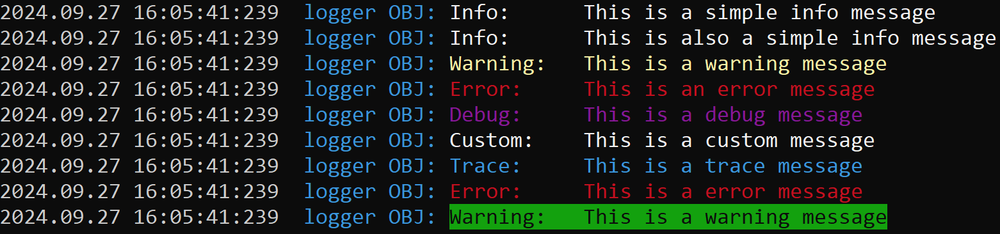
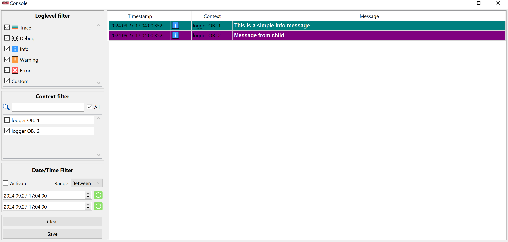
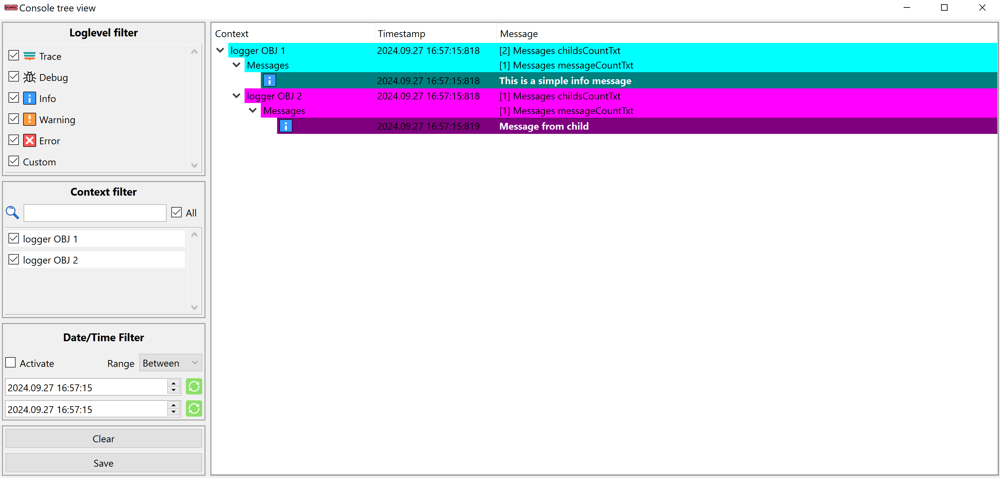
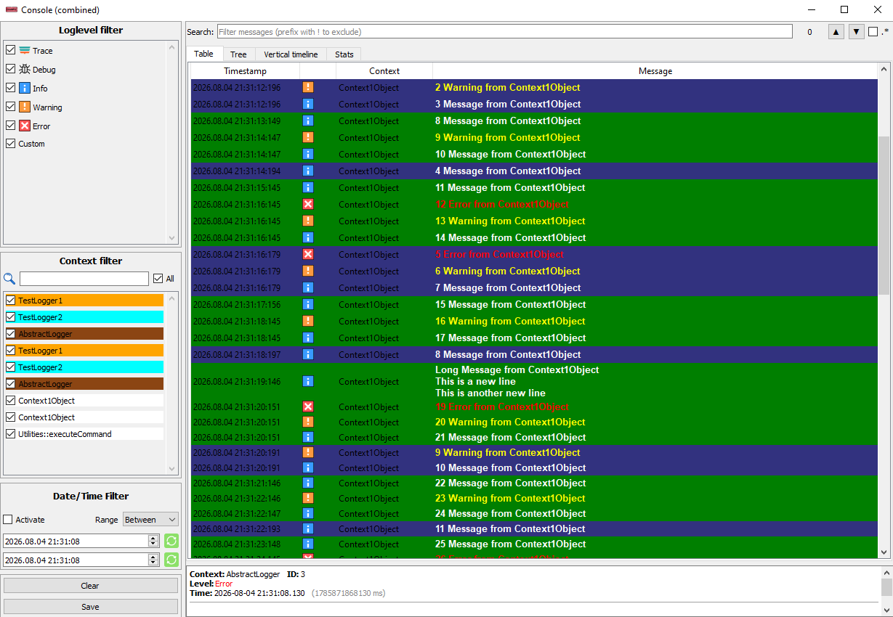
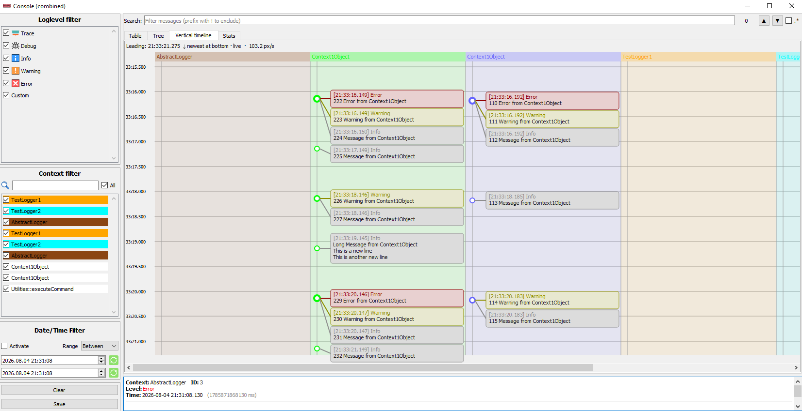
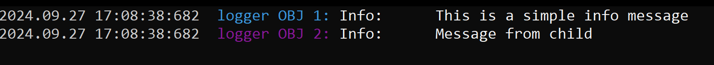

# Logger

## Overview
* [About](#about)
* [Concept](#concept)
* [Installation](#installation)
  * [Dependencies](#dependencies)
  * [How to build](#how-to-build)
* [How to use](#how-to-use)
  * [Basic example](#basic-example)
  * [Nested loggers](#nested-loggers)
  * [Custom colors](#custom-colors)
  * [Enabling / disabling a logger](#enabling--disabling-a-logger)
  * [LogObject API](#logobject-api)
  * [Available colors](#available-colors)
  * [Customising level colors](#customising-level-colors)
  * [Dark / light mode](#dark--light-mode)
  * [LogManager](#logmanager)
  * [Threading](#threading)
  * [Linking against the library](#linking-against-the-library)
  * [Sandbox example](#sandbox-example)
  * [Advanced: logger-ID filters](#advanced-logger-id-filters)
  * [Optional: easy_profiler integration](#optional-easy_profiler-integration)
* [Receiver types](#receiver-types)
  * [QConsoleView](#qconsoleview)
  * [QTreeConsoleView](#qtreeconsoleview)
  * [QCombinedConsoleView](#qcombinedconsoleview)
  * [QVerticalTimelineView](#qverticaltimelineview)
  * [QStatsConsoleView](#qstatsconsoleview)
  * [NativeConsoleView](#nativeconsoleview)
  * [FilePlotter](#fileplotter)
  * [Custom receiver implementation](#custom-receiver-implementation)
* [View features](#view-features)
  * [Search bar](#search-bar)
  * [Find next / previous](#find-next--previous)
  * [Level and context filters](#level-and-context-filters)
  * [Date-time filter](#date-time-filter)
  * [Details pane](#details-pane)
  * [Row context menu](#row-context-menu)
  * [In-cell text selection and copy](#in-cell-text-selection-and-copy)
  * [Feature flags](#feature-flags)
  * [Sub-widget toggles](#sub-widget-toggles)
* [Persisting logs](#persisting-logs)
  * [Saving visible messages](#saving-visible-messages)
  * [Loading a log file](#loading-a-log-file)
  * [File format](#file-format)


## About
>  This library was created using the [library template](https://github.com/KROIA/QT_cmake_library_template)


The logger library can be used in your project to print messages to the console. A message is categorized in 6 levels:

|Level |Meaning |
|---|---|
|<span style="color:rgb(0,255,255)">trace</span>|Can be used to print call stacks|
|<span style="color:rgb(255,0,255)">debug</span>|Debug infos that are used for development|
|<span style="color:rgb(0,0,0)">info</span>|Info outputs that can be helpfull for the end user|
|<span style="color:rgb(230,230,0)">warning</span>|Warning messages|
|<span style="color:rgb(255,0,0)">error</span>|Error messages|
|<span style="color:rgb(0,255,0)">custom</span>|No specific usecase, just another separate category |

---
## Concept
The library uses the Qt signal & slot system to deliver log messages from `LogObject`s to receivers.
You create one or more [receivers](#receiver-types) and one or more `LogObject`s. Messages emitted by any `LogObject` are automatically delivered to every attached receiver — receivers do not need to be wired to loggers by hand. The receiver is responsible for storing / displaying the messages; `LogObject`s themselves do not retain what they emit.

Receivers subscribe to the shared `LogManager` singleton on construction. Late-subscribed receivers (created after some `LogObject`s already exist) automatically get a snapshot of the existing loggers so they can pre-populate their state.

---

## Installation
#### Dependencies
* Qt5 or Qt6 [click here for more informations.](https://github.com/KROIA/QT_cmake_library_template/blob/main/documentation/HowToUse.md#dependencies)
* Qt modules
  * Core
  * Widgets

#### How to build
* If you want to use the logger library in a project that is based on the [library template](https://github.com/KROIA/QT_cmake_library_template), you can simply copy the `Logger.cmake` file to your projects `dependencies` folder and reconfigure that project.

* If you want to use the logger library as standalone build and include the logger lib manually to your project, download the repository and run the `build.bat` or open the CMakeLists.txt using Visual Studio and build and install the library.

---

## How to use

#### Basic example
``` C++
#include <QApplication>
#include "Logger.h"

int main(int argc, char *argv[])
{
    QApplication app(argc, argv);

    // (1) Create a receiver
    Log::UI::NativeConsoleView plotter;

    // (2) Create a logger object
    Log::LogObject logger("logger OBJ");

    // (3) Optional: give it a color
    logger.setColor(Log::Colors::Console::Foreground::cyan);

    // (4) Emit messages
    logger.log("This is a simple info message");
    logger.logInfo("Also an info message");
    logger.logWarning("A warning");
    logger.logError("An error");
    logger.logDebug("A debug line");
    logger.logCustom("A custom-level line");
    logger.logTrace("A trace line");

    logger.log("Level+color forwarded to the message", Log::Level::warning,
               Log::Colors::Console::Background::green);

    // Qt event loop drives the queued signal delivery to the receiver
    return app.exec();
}
```
1) Create a receiver that listens to the signals from the log objects.
2) The logger object is used to create log messages.
3) Each logger object can have an individual color which is used on the console.
4) Depending on the level, call the specific helper (`logInfo`, `logWarning`, ...) or the generic `log(text, level, color)`.

<div style="text-align: center;">
    
</div>

#### Nested loggers
Loggers form a tree. Pass a parent's `LoggerID` to nest a child under it — the tree view and file format preserve this structure.

``` C++
Log::LogObject root("app");
Log::LogObject net(root.getID(), "network");
Log::LogObject worker(net.getID(), "worker");

worker.logInfo("Connected");   // shown as app → network → worker → Connected
```

#### Custom colors
Every logger gets a default color; you can override it or set a color on a single message:
``` C++
Log::LogObject l("io");
l.setColor(Log::Colors::orange);            // this logger's default

l.logInfo("plain info");                    // orange in the views
l.log("This one is red",  Log::Level::info, Log::Colors::red); // per-message override
```

#### Enabling / disabling a logger
A disabled logger emits no messages — useful for silencing a subsystem at runtime without recompiling.
``` C++
Log::LogObject net("network");
net.setEnabled(false);        // net stops emitting
net.logWarning("suppressed"); // dropped, no receiver sees this
net.setEnabled(true);         // resumes
```

#### LogObject API
Public methods available on every `LogObject`:

| Method | Description |
|---|---|
| `LogObject(const std::string& name)`                                | Root-level logger with the given name |
| `LogObject(LoggerID parentID, const std::string& name)`             | Logger nested under an existing one |
| `LogObject(const LogObject& parent, const std::string& name)`       | Same as above; parent by reference |
| `void log(msg [, Level [, Color]])`                                 | Emit a message; level defaults to `info` |
| `logTrace / logDebug / logInfo / logWarning / logError / logCustom` | Level-specific convenience wrappers |
| `void setName(const std::string&)` · `std::string getName() const`  | Rename the logger; visible in all views |
| `void setColor(const Color&)` · `Color getColor() const`            | Per-logger color used in every view |
| `void setEnabled(bool)` · `bool isEnabled() const`                  | Toggle whether this logger emits |
| `LoggerID getID() const` · `LoggerID getParentID() const`           | Identity queries |

Changing a logger's `name`, `color`, or `enabled` at runtime is broadcast to every receiver so views update in place.

#### Available colors
The `Log::Colors` namespace exposes a set of predefined `Color` constants suitable for both terminal and Qt output:

| Bright | Light variant |
|---|---|
| `red`, `green`, `blue`               | `lightRed`, `lightGreen`, `lightBlue` |
| `yellow`, `magenta`, `cyan`          | `lightMagenta`, `lightCyan` |
| `white`, `black`, `brown`, `orange`  | `lightGray`, `darkGray` |

There are also `Colors::Console::Foreground::*` and `Colors::Console::Background::*` subnamespaces for use with `NativeConsoleView`. A `Log::Color` value can be constructed from RGB directly:

``` C++
Log::Color teal(0x0d, 0x9a, 0x8f);
logger.setColor(teal);
```

#### Customising level colors
Every level has a default color; you can override the entire set at process start:

``` C++
Log::LevelColors custom {
    Log::Colors::lightGray,   // trace
    Log::Colors::lightMagenta,// debug
    Log::Colors::white,       // info
    Log::Colors::orange,      // warning
    Log::Colors::lightRed,    // error
    Log::Colors::lightGreen   // custom
};
Log::Message::setLevelColors(custom);
```
The new palette applies to every subsequent message and to how every view renders per-level accents (dot fills, bubble borders, stats bars).

#### Dark / light mode
The library ships a ready-made dark stylesheet for the Qt views:

``` C++
qApp->setStyleSheet(Log::Resources::getDarkStylesheet());
Log::Color::setDarkMode(true);       // biases default color mappings for dark
Log::Color::setDarkModeFactor(0.8f); // optional: intensity of the bias
```
Every widget-based view detects the active palette at paint time and picks appropriate contrasts:

* Stats bars use a light track in light mode, dark in dark mode.
* The vertical timeline's bubble fill uses HSL lightness `220/255` in light mode, `60/255` in dark mode; border / header text darken in light mode so near-white level colors stay readable.
* Grid lines and axis lines use `QPalette::Mid`, so they adapt automatically.

Nothing needs to be reconfigured after a theme change — the next paint picks it up.

#### LogManager
`Log::LogManager` is the singleton hub that connects loggers to receivers. In normal use you don't touch it — instantiating a `LogObject` or an `AbstractReceiver` registers with it automatically. It is exposed for cases like introspection:

``` C++
// Snapshot every logger currently known to the process.
std::vector<Log::LogObject::Info> loggers = Log::LogManager::getLogObjectsInfo();
for (const auto& l : loggers)
    qDebug() << l.id << QString::fromStdString(l.name);

// Look up one logger's info by ID (returns a default-constructed Info if unknown).
Log::LogObject::Info info = Log::LogManager::getLogObjectInfo(someId);
```

#### Threading
`LogObject::log(...)` may be called from any thread. The library dispatches messages via Qt's queued signal system, so each receiver sees them on **its own** thread (typically the GUI thread for the widget receivers).

Two consequences worth knowing:

* You never need locks around `log*(...)` calls yourself.
* The widget receivers stay non-blocking under high message rates — messages queue up and are drained in batches. If the GUI thread is starved, throughput drops gracefully; the sender never blocks.

Late-subscribed receivers (constructed *after* some `LogObject`s already exist) automatically receive a snapshot of the existing loggers on the receiver's thread before the live stream starts, so their views pre-populate correctly.

#### Linking against the library
Two build targets are produced per configuration:

* `Logger_shared`   — dynamic library (`Logger.dll` / `libLogger.so`)
* `Logger_static`   — static library
* `Logger_static_profile` — static build with easy_profiler hooks (only when the optional dependency is present)

In a consumer's CMake:
``` cmake
find_package(Logger CONFIG REQUIRED)
target_link_libraries(myapp PRIVATE Logger::Logger_shared)  # or _static
```
The library requires the Qt modules listed in [Dependencies](#dependencies); consumers should also `find_package(Qt5 COMPONENTS Core Widgets REQUIRED)` (or Qt6).

Every public API is reachable via one include:
``` C++
#include "Logger.h"
```

#### Sandbox example
A working reference application lives at `Examples/LoggerSandbox/`. It spins up several loggers (including one on a worker thread), instantiates each Qt view, and demonstrates the standalone views side-by-side. Build the project and run `LoggerSandbox` to see everything in one place.

#### Advanced: logger-ID filters
For programmatic filtering (independent of the view checkboxes), `Log::LoggerIDFilter` filters messages by logger identity. Useful for feeding a receiver only a subset of loggers:

``` C++
Log::LoggerIDFilter filter;
filter.setMode(Log::LoggerIDFilter::Include);
filter.setIncludeChildren(true);         // implicitly cover nested loggers
filter.addLoggerID(myLogger.getID());

// Attach the filter to any receiver that supports it.
```
`Mode::Include` only lets listed IDs through; `Mode::Exclude` drops them. With `setIncludeChildren(true)`, adding a parent ID automatically covers every descendant.

#### Optional: easy_profiler integration
If [easy_profiler](https://github.com/yse/easy_profiler) is present at build time, an additional `Logger_static_profile` target is produced with profiling hooks compiled in. Wrap the application in `Log::Profiler::start()` / `Log::Profiler::stop(path)` and open the resulting `.prof` file in the easy_profiler GUI. Without easy_profiler the hooks compile to no-ops.

``` C++
int main(int argc, char* argv[]) {
    Log::Profiler::start();
    // ... application ...
    Log::Profiler::stop("app.prof");
}
```

---

## Receiver types

The library ships several receivers. They all attach to the shared `LogManager` on construction, so you don't wire signals by hand — instantiate them and they receive every message.

* [`QConsoleView`](#qconsoleview) — flat table
* [`QTreeConsoleView`](#qtreeconsoleview) — parent/child tree
* [`QCombinedConsoleView`](#qcombinedconsoleview) — Table + Tree + Vertical timeline + Stats tabs in one window
* [`QVerticalTimelineView`](#qverticaltimelineview) — per-context columns with always-visible message bubbles along a vertical time axis
* [`QStatsConsoleView`](#qstatsconsoleview) — counters and rate dashboard
* [`NativeConsoleView`](#nativeconsoleview) — plain terminal output
* [`FilePlotter`](#fileplotter) — writes JSON log file to disk
* [Custom receiver](#custom-receiver-implementation) — subclass `AbstractReceiver` for anything else

#### QConsoleView
Flat table view. Columns: time, level, context, message. Rows can be filtered by level, context, date-time range, and message text.

``` C++
#include <QApplication>
#include "Logger.h"

int main(int argc, char *argv[])
{
    QApplication app(argc, argv);

    Log::UI::QConsoleView view;
    view.show();

    Log::LogObject logger("io");
    logger.logInfo("Hello");

    return app.exec();
}
```
<div style="text-align: center;">
    
</div>

#### QTreeConsoleView
Same data, arranged as a tree that preserves parent/child logger relationships.

``` C++
Log::UI::QTreeConsoleView tree;
tree.show();

Log::LogObject app("app");
Log::LogObject net(app.getID(), "network");

app.logInfo("Started");
net.logInfo("Connected");
```
<div style="text-align: center;">
    
</div>

#### QCombinedConsoleView
Four tabs — Table, Tree, Vertical timeline, Stats — sharing one filter panel. Level and context checkboxes, the search bar, and the details pane apply to all four tabs at once.

``` C++
Log::UI::QCombinedConsoleView combined;
combined.show();
combined.setCurrentTab(Log::UI::QCombinedConsoleView::Tab::verticalTime);
```

<div style="text-align: center;">
    
</div>


Available tabs:

| `Tab` value          | Description |
|---|---|
| `Tab::table`         | Flat table view (same as `QConsoleView`) |
| `Tab::tree`          | Tree view (same as `QTreeConsoleView`)   |
| `Tab::verticalTime`  | Per-context columns with message bubbles (same as `QVerticalTimelineView`) |
| `Tab::stats`         | Counter dashboard (same as `QStatsConsoleView`) |

Saving visible messages (`saveVisibleMessages(path)`) exports rows from whichever row-based tab is active (table or tree). The other tabs don't hold raw messages.

#### QVerticalTimelineView
Per-context columns arranged left-to-right, with a vertical time axis running through each. Every message renders as a colored dot on its column's axis plus an always-visible bubble to its right showing timestamp, level, and full multi-line text.

``` C++
Log::UI::QVerticalTimelineView vt;
vt.show();
vt.setDirection(Log::UI::QVerticalTimelineView::Direction::Down); // default
```

Interactions:

| Action | Result |
|---|---|
| Mouse wheel                     | Zoom in / out, anchored under the cursor |
| Shift + wheel                   | Horizontal scroll (pan between columns) |
| Left-drag                       | Pan the time axis; auto-scroll pauses |
| Right-click                     | Resume auto-scroll to the leading edge |
| Release drag near leading edge  | Auto-scroll re-engages |
| Double-click a bubble           | Copy the message text to the clipboard |
| Hover a bubble or dot           | Tooltip with context, timestamp, level, and message |

Rendering:

* Dot **fill** = level color (severity), 2-px outer **ring** = context color. Radius scales with severity.
* Bubble **border + connector** = level color, **fill** = opaque grayish tint of the level color.
* Column **background** = translucent context color so identity is visible at a glance in both dark and light palettes.
* When zoomed way out (< 3 px/s) or when the column is narrower than a bubble fits, only dots render — a footer hint indicates the mode.
* Overlap resolution: bubbles for messages arriving within the same time slot stack downward from the first visible one; connector lines still point back to each dot's true timestamp.

`setDirection(Direction::Up)` flips the flow so newer messages appear at the top and auto-scroll clamps to the top edge. Default is `Direction::Down`.

<div style="text-align: center;">
    
</div>


#### QStatsConsoleView
Counter dashboard: total messages, rolling msg/s rate, per-level bar chart, per-context bar chart. Level bars scale to the busiest level; context bars scale to the busiest context so relative volumes read at a glance. Disabled contexts appear struck-through; darkened bars indicate filtered-out levels.

``` C++
Log::UI::QStatsConsoleView stats;
stats.show();
```

Nothing is emitted by user actions on this view — it is a read-only overview.


#### NativeConsoleView
Basic terminal output; no tree, no filtering.
``` C++
Log::UI::NativeConsoleView console;
console.show();
```
<div style="text-align: center;">
    
</div>

#### FilePlotter
Writes messages as JSON to a file. See [file format](#file-format).
``` C++
Log::FilePlotter plotter("outputFile.log");
// Optional: override the timestamp format used inside the file.
Log::FilePlotter plotterHiRes("hires.log",
    Log::DateTime::Format::hourMinuteSecondMillisecond | Log::DateTime::Format::yearMonthDay);
```
Intermediate directories are created if they don't exist. Every message and every logger-info change is flushed to disk as it arrives; the file is a well-formed JSON array at all times.

#### Custom receiver implementation
Subclass `AbstractReceiver` and override the callbacks you care about:
``` C++
#include "Logger.h"

class CustomReceiver : public Log::AbstractReceiver
{
public:
    CustomReceiver() { /* automatically subscribes on construction */ }

protected:
    void onNewLogger(Log::LogObject::Info info) override        { /* ... */ }
    void onLoggerInfoChanged(Log::LogObject::Info info) override { /* ... */ }
    void onLogMessage(Log::Message message) override            { /* ... */ }
    void onChangeParent(Log::LoggerID childID,
                        Log::LoggerID newParentID) override      { /* ... */ }
};
```
You don't need to connect signals manually — the base class handles the subscription and delivers every message on the receiver's thread via queued connections.

---

## View features

Every view that derives from `QAbstractLogWidget` (all Qt-widget views above) shares the same feature set.

#### Search bar
An always-visible text field filters messages by substring (case-insensitive).

* Prefix the text with `!` to **exclude** matches instead of including them: `!heartbeat` hides every message containing "heartbeat".
* Toggle the `.*` checkbox to interpret the text as a **regular expression** (also case-insensitive).

``` C++
view.setSearchTextProgrammatic("!heartbeat", /*regex*/ false);
```

#### Find next / previous
The `▲` / `▼` buttons next to the search box jump the row selection to the next / previous matching row. `Enter` in the search box triggers "next". A count label shows how many rows currently match; it reads `0` when no search text is set.

Programmatically:
``` C++
view.findNext(/*forward=*/true);
int n = view.matchCount();
```

#### Level and context filters
The left-hand sidebar has one checkbox per level (`trace`, `debug`, `info`, `warning`, `error`, `custom`) and one per known logger context. Programmatic access:

``` C++
view.setLevelEnabled(Log::Level::trace, false);   // hide trace messages
view.setContextEnabled(logger.getID(), false);    // hide one context
view.soloContext(logger.getID());                 // hide everything else
view.hideContext(logger.getID());                 // hide just this one
```

#### Date-time filter
Enable the date-time filter in the sidebar, set min / max via the date-time widgets, and pick a range type: `before`, `after`, `between`, `equal`. Only messages whose timestamp satisfies the predicate are shown.

#### Details pane
A read-only pane below the content shows the currently selected row's full details: context name and ID, level (colored), timestamp in both human-readable and epoch-ms form, and the full multi-line message body. It updates on selection change and preserves whitespace in the message body.

#### Row context menu
Right-click a row in the table, tree, or combined view:

| Menu item | Action |
|---|---|
| Copy message text                | Copy plain text of the message to the clipboard |
| Copy row as JSON *(table only)*  | Copy the message serialized as JSON |
| Solo this context                | Hide all other contexts |
| Hide this context                | Hide just this context |
| Hide messages like this          | Sets the search box to `!<full message text>` |

#### In-cell text selection and copy
Click a cell to enter text-selection mode — drag inside the cell to select text (individual characters, not just whole rows). A double-click anywhere on a row copies the full message text to the clipboard. Selection survives incoming messages.

#### Feature flags
Turn individual UI features on or off per view instance. Useful for building a minimal read-only viewer or, conversely, ensuring the full toolset shows up.

``` C++
using F = Log::UIWidgets::QAbstractLogWidget;

// Strip a view down to its content only:
view.setFeatureEnabled(F::SearchBar,          false);
view.setFeatureEnabled(F::SearchRegexCheckBox, false);
view.setFeatureEnabled(F::FindNextPrev,       false);
view.setFeatureEnabled(F::MatchCount,         false);
view.setFeatureEnabled(F::DetailsPane,        false);
view.setFeatureEnabled(F::RowContextMenu,     false);

bool on = view.isFeatureEnabled(F::SearchBar);
```

Flag applicability:

| Feature | Table | Tree | Combined | Vertical timeline | Stats |
|---|:---:|:---:|:---:|:---:|:---:|
| `SearchBar` / `SearchRegexCheckBox` / `MatchCount` / `FindNextPrev` | ✓ | ✓ | ✓ | ✓ (search only) | ✓ (search only) |
| `DetailsPane`      | ✓ | ✓ | ✓ | — | — |
| `RowContextMenu`   | ✓ | ✓ | ✓ | — | — |

#### Sub-widget toggles
For coarser stripping, hide entire sidebar sections:
``` C++
using SW = Log::UIWidgets::QAbstractLogWidget;

view.disableSubWidget(SW::settingsFrame);
view.disableSubWidget(SW::logLevelFilter);
view.disableSubWidget(SW::contextFilter);
view.disableSubWidget(SW::dateTimeFilter);
view.disableSubWidget(SW::editFrame);
// re-enable:
view.enableSubWidget(SW::logLevelFilter);
```

#### Collapsible settings panel
The whole left settings column collapses horizontally "to the left" into a thin
persistent strip (~24 px) so the console (`contentFrame`) reclaims the freed
width. The strip always shows a toggle button (▶ to expand when collapsed, ◀ to
collapse when expanded), so the panel can always be re-opened. Per-element
collapse of the individual filter panels has been removed.

``` C++
using SW = Log::UIWidgets::QAbstractLogWidget;

// Collapse / expand the entire settings column to the thin left strip:
view.setSubWidgetCollapsed(SW::settingsFrame, true);
bool collapsed = view.isSubWidgetCollapsed(SW::settingsFrame);

// React to collapse changes (only settingsFrame fires):
QObject::connect(&view, &Log::UIWidgets::QAbstractLogWidget::subWidgetCollapsedChanged,
    [](SW::SubWidget w, bool collapsed){ /* ... */ });
```

**Defaults:** the settings column starts **expanded** (normal look); call
`setSubWidgetCollapsed(SW::settingsFrame, true)` to start collapsed. Only
`settingsFrame` is collapsible — the inner filter panels (`logLevelFilter`,
`contextFilter`, `dateTimeFilter`, `editFrame`) and `contentFrame` are not.
`setSubWidgetCollapsible()` is retained as a deprecated no-op for source
compatibility. Collapse is orthogonal to `enable/disableSubWidget` (whole-frame
visibility): disabling the settings frame hides the strip too, and re-enabling
restores the stored collapse state.

---

## Persisting logs

#### Saving visible messages
Any row-based view can dump its currently-visible messages to a JSON file:
``` C++
view.saveVisibleMessages("session.log");
```
"Visible" means: whatever passes the current level, context, date-time and text filters. Loggers that don't appear in any visible message are omitted.

The **Save** button in the sidebar does the same via a file picker.

#### Loading a log file
Any row-based view can load a file previously saved by this library:
``` C++
view.loadMessagesFromFile("session.log");
```
Logger metadata (name, color, parent) is restored so the tree view rebuilds the original hierarchy.

#### File format
A logger file is a JSON array. First element: library metadata. Next: one entry per logger context (id, name, color, parent, creation time). Then: one entry per message.

Timestamps are stored as **milliseconds since Unix epoch** (numeric), which is compact and easy to parse externally. Older files with formatted date-time strings still load — the reader accepts both.

``` json
[
  {
    "levelInfo": { "Trace": 0, "Debug": 1, "Info": 2, "Warning": 3, "Error": 4, "Custom": 5 },
    "name": "Logger",
    "version": "01.01.0000"
  },
  {
    "id": 1,
    "parentId": 0,
    "name": "app",
    "color": "#FFAA33",
    "enabled": true,
    "creationTime": 1735689305973
  },
  {
    "id": 2,
    "parentId": 1,
    "name": "network",
    "color": "#00CCFF",
    "enabled": true,
    "creationTime": 1735689305974
  },
  {
    "id": 1,
    "level": 2,
    "color": "#FFAA33",
    "text": "Started",
    "dateTime": 1735689306100
  },
  {
    "id": 2,
    "level": 3,
    "color": "#FFEE00",
    "text": "Connection lost",
    "dateTime": 1735689307250
  }
]
```
